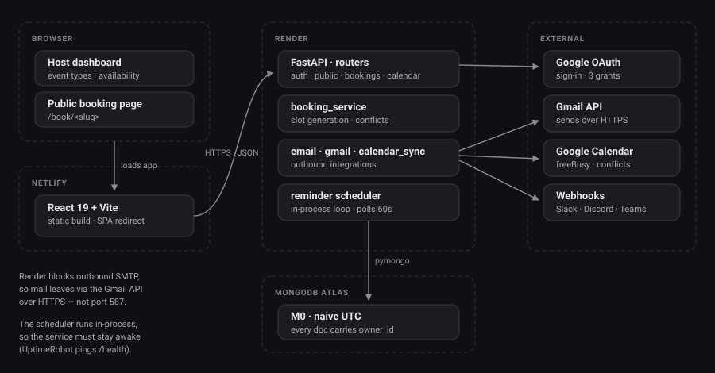
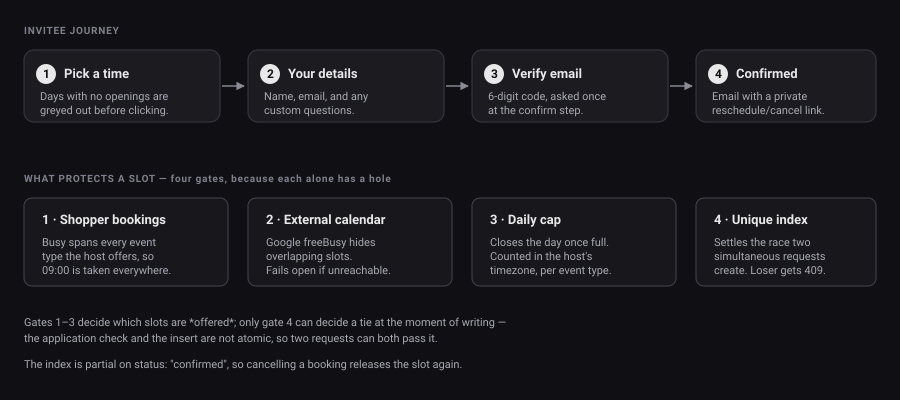

# Architecture

How Shopper is put together, and why the awkward parts are the way they are.
For running and deploying it, see [Operations](operations.md); for the endpoint
list, [API reference](api-reference.md).



---

## 1. Shape of the system

Three deployed pieces and no message queue, no cache, no worker tier:

| Piece | Runs on | Notes |
| :-- | :-- | :-- |
| React 19 + Vite SPA | Netlify | Static build. `VITE_API_URL` is **inlined at build time**, so changing it needs a rebuild, not a restart. |
| FastAPI app | Render | Serves the API *and* runs the reminder scheduler in-process. |
| MongoDB | Atlas M0 | Documents store **naive UTC**. |

The reminder scheduler being in-process is the single most load-bearing
constraint on hosting: it is an `asyncio` task started in the app lifespan, so
Shopper needs a process that **stays alive**. Any serverless target that
freezes between requests silently stops sending reminders while the API still
looks healthy.

---

## 2. Multi-tenancy

Every account is a tenant. `event_types`, `availability_settings`,
`availability_rules`, `blockout_dates`, `bookings`, `workflows` and
`integrations` all carry an `owner_id`, and every admin endpoint is scoped to
the authenticated user.

Two deliberate choices:

- **Missing rows return 404, not 403.** A 403 confirms that an id exists, which
  lets someone enumerate other tenants' bookings by probing. 404 leaks nothing.
- **Event-type slugs are globally unique.** That is what keeps public links at
  `/book/<slug>` with no username segment. The cost is a global namespace, so
  slug collisions across tenants are rejected.

`app/security.py` is the only place that turns a request into a user. Routers
depend on `require_user` / `require_owner_id` rather than reading headers, so
there is no second, subtly different auth path to keep in sync.

---

## 3. Time

**MongoDB stores naive UTC.** Nothing in the database carries a timezone.

The host's timezone (from `availability_settings`) is what working hours mean:
a rule of `09:00–17:00` is 09:00–17:00 *for the host*. Slots go out with an
unambiguous `start_utc`, so the invitee's browser can render them in any
timezone without the server knowing which.

The subtle one is `local_date_for()`. Deriving a booking's calendar day from
the raw payload would use the *sender's* offset — a 22:00 IST slot sent as UTC
looks like the previous day and validates against the wrong set of slots. So
the day is always derived after normalising to the host's zone.

This is also why the booking page fetches **three days** of slots (previous,
selected, next) and filters client-side: a visitor's day can straddle two of
the host's days.

---

## 4. Slot generation

`generate_slots` needs four things — the host's timezone, their weekly rules,
their blockouts, and their existing bookings — and **none of them vary by day**.

Calling it in a loop therefore re-read all four on every iteration. A month
view cost roughly **154 round trips** to a remote Atlas cluster, which was the
dominant source of latency on the calendar.

`_load_range` now reads each collection once for the whole span and
`generate_available_days` walks the days in memory:

```
per-day scan   154 queries
batched          5 queries      (~30× fewer, identical output)
```

> **If you add anything that needs another collection, read it in
> `_load_range`.** A query inside `_slots_for_day` silently reintroduces the
> N+1 — it will still be correct, just slow in a way that only shows up on a
> month view against a remote database.

The fifth query is the external-calendar lookup; it is cached, including the
negative result, so hosts without a connected calendar don't pay for it twice.

---

## 5. What stops a slot being double-booked



Four independent layers, because each one alone has a hole:

**1. Other Shopper bookings.** Busy times span *every* event type the host
offers, so a 09:00 "Intro Call" also blocks 09:00 on "Deep Dive".

**2. The host's external calendar.** `services/calendar_sync.py` asks Google's
freeBusy endpoint for the same span. This **fails open** — if Google is
unreachable or the grant was revoked, the host keeps their availability rather
than having the booking page go dark. That trades a possible double-book for
uptime, so every failure is logged, and a rejected grant marks the integration
`invalid` so the UI can say "reconnect" instead of failing silently forever.

**3. A daily cap.** `max_bookings_per_day` (0 = unlimited) closes the day once
reached. Counted in the *host's* timezone, since that is the day the cap is
about, and per event type, so one link filling up doesn't close another.

**4. A unique index.** `uniq_confirmed_slot` on `(owner_id, start_time)`,
partial on `status: "confirmed"`.

Gates 1–3 decide which slots are *offered*. Only gate 4 can decide a tie at the
moment of writing: the application checks for a conflict and then inserts, and
those two steps are not atomic, so two simultaneous requests can both pass the
check. The database settles it and the loser gets a `409`. The index is
**partial** so a cancelled booking stops reserving the slot.

---

## 6. Authentication

- `POST /api/auth/login` issues a JWT (HS256).
- API keys (`sk_live_…`) are accepted on the same `Authorization: Bearer`
  header; only a SHA-256 hash is stored, so a database dump doesn't yield
  usable keys.
- Google OAuth has **three separate grants** — sign in, read a calendar, send
  mail — so a host can sign in without handing over their mailbox. Each has its
  own callback URI. See [Email delivery](email-delivery.md) for the sending one.

Invitees never have accounts. Self-service reschedule and cancel work through
an unguessable per-booking `manage_token` that grants nothing beyond that one
booking.

---

## 7. Reminder scheduler

`app/services/scheduler.py` polls every 60 seconds for bookings entering a
workflow's reminder window.

Delivery is **at-most-once per (booking, workflow)**, enforced by a unique
index on `reminder_log` — the insert *is* the lock, so overlapping polls or a
second instance cannot double-send. Catch-up is bounded to two hours, so a
service that was asleep doesn't flood old reminders on wake.

---

## 8. Collections

| Collection | Holds | Notable index |
| :-- | :-- | :-- |
| `users` | Accounts, `booking_username`, calendar feed token | `email` unique; `booking_username` unique sparse |
| `event_types` | Meeting templates, questions, caps | `url_slug` unique (global) |
| `availability_settings` | One row per host: timezone | `owner_id` unique sparse |
| `availability_rules` | Weekly windows, several per weekday | `(owner_id, day_of_week)` |
| `blockout_dates` | Date ranges | ISO strings compare lexicographically |
| `bookings` | The bookings themselves | `uniq_confirmed_slot` partial unique |
| `workflows` | Automations and reminders | `(owner_id, created_at)` |
| `integrations` | Webhooks, calendar grant | `(owner_id, key)` unique |
| `app_settings` | App-wide config (Gmail grant) | `key` |
| `email_otps` | Hashed codes | TTL |
| `verification_tokens` | Proof of a verified email | `token` unique |
| `rate_limits` | Per-IP counters | TTL on `expires_at` |
| `reminder_log` | Sent reminders | `(booking_id, workflow_id)` unique |
| `oauth_states` | Single-use OAuth state | `state` unique, TTL |

Blockouts store ISO date **strings** rather than dates on purpose: ISO dates
compare correctly with `$lte`/`$gte` lexicographically, so a range match needs
no deserialisation.

---

## 9. Layout

```
backend/app/
  main.py           app wiring, CORS, security headers, lifespan
  config.py         env-driven settings + production validation
  security.py       password hashing, JWT, auth dependencies
  database.py       Mongo client and index management
  migrations.py     idempotent startup migrations
  serializers.py    document -> API shape helpers
  schemas.py        Pydantic request/response models
  routers/          auth, event_types, availability, bookings, blockouts,
                    public, otp, integrations, calendar, workflows
  services/         booking_service (slots), calendar_sync (freeBusy),
                    gmail_sender, email, otp, webhooks, workflows,
                    scheduler, rate_limit
  scripts/          smoke_test.py
frontend/src/
  pages/            route-level components
  components/       Toast, Skeleton, ThemeToggle, AuthContext…
  services/api.js   API client
  utils/date.js     timezone-aware formatting
  index.css         design tokens + component styles
```

---

## 10. Things that will bite you

- **`VITE_API_URL` is inlined at build time.** Unset, the build silently falls
  back to the production URL in `api.js` — the site loads, looks fine, and
  every call goes to the wrong backend.
- **Render blocks outbound SMTP.** Mail must leave over HTTPS. See
  [Email delivery](email-delivery.md).
- **Atlas M0 pauses after ~60 days idle and does not auto-wake.** Unlike
  Render, a request will not revive it — see [Operations](operations.md).
- **`localhost` and `127.0.0.1` are not interchangeable on Windows.** Vite
  binds IPv6, uvicorn binds IPv4 by default; mixing them produces failures that
  look like application bugs.
